# Solution Architecture — Spring PetClinic REST API

## 1. Overview

The Spring PetClinic REST API is a veterinary clinic management microservice built on **Spring Boot 4.0.2** with **Java 17**. It exposes a RESTful API for managing pet owners, their pets, veterinarians, vet specialties, pet visits, and application users.

**Core Responsibilities:**
- CRUD operations for pet owners, pets, pet types, veterinarians, specialties, and visits
- User management with role-based access control (RBAC)
- API-first development via OpenAPI 3.0.1 specification with code generation

**Key Dependencies:**
- **Spring Boot 4.0.2** — Web MVC, Data JPA, JDBC, Security, Cache, Actuator
- **OpenAPI Generator** — Generates DTOs and API interfaces from `openapi.yml`
- **MapStruct 1.6.3** — Generates entity-to-DTO mapper implementations
- **Jackson** — JSON serialization/deserialization
- **JPA / Hibernate** — ORM layer (with alternative JDBC and Spring Data JPA implementations)
- **H2 / MySQL / PostgreSQL** — Pluggable database backends via Spring profiles
- **Spring Security** — Optional HTTP Basic authentication with JDBC-backed user store
- **springdoc-openapi 3.0.1** — Swagger UI at `/petclinic/swagger-ui.html`

---

## 2. High-Level Component Diagram

```mermaid
graph TD
    Client["Client (Browser / Postman / Frontend App)"]

    subgraph "Spring Boot Application — localhost:9966/petclinic"
        SwaggerUI["Swagger UI<br/>/petclinic/swagger-ui.html"]
        SecurityFilter["Spring Security Filter Chain<br/>(HTTP Basic / Disabled)"]

        subgraph "REST API Layer — /api"
            OwnerCtrl["OwnerRestController<br/>implements OwnersApi"]
            PetCtrl["PetRestController<br/>implements PetsApi"]
            PetTypeCtrl["PetTypeRestController<br/>implements PettypesApi"]
            VetCtrl["VetRestController<br/>implements VetsApi"]
            VisitCtrl["VisitRestController<br/>implements VisitsApi"]
            SpecialtyCtrl["SpecialtyRestController<br/>implements SpecialtiesApi"]
            UserCtrl["UserRestController<br/>implements UsersApi"]
        end

        ExceptionAdvice["ExceptionControllerAdvice<br/>(@ControllerAdvice)"]

        subgraph "Mapper Layer (MapStruct)"
            OwnerMapper["OwnerMapper"]
            PetMapper["PetMapper"]
            VetMapper["VetMapper"]
            VisitMapper["VisitMapper"]
            SpecialtyMapper["SpecialtyMapper"]
            PetTypeMapper["PetTypeMapper"]
            UserMapper["UserMapper"]
        end

        subgraph "Service Layer"
            ClinicService["ClinicService / ClinicServiceImpl"]
            UserService["UserService / UserServiceImpl"]
        end

        subgraph "Repository Layer (Profile-based)"
            subgraph "JPA (@Profile jpa)"
                JpaOwner["JpaOwnerRepositoryImpl"]
                JpaPet["JpaPetRepositoryImpl"]
                JpaVet["JpaVetRepositoryImpl"]
                JpaVisit["JpaVisitRepositoryImpl"]
                JpaPetType["JpaPetTypeRepositoryImpl"]
                JpaSpec["JpaSpecialtyRepositoryImpl"]
                JpaUser["JpaUserRepositoryImpl"]
            end
            subgraph "JDBC (@Profile jdbc)"
                JdbcOwner["JdbcOwnerRepositoryImpl"]
                JdbcPet["JdbcPetRepositoryImpl"]
                JdbcVet["JdbcVetRepositoryImpl"]
                JdbcVisit["JdbcVisitRepositoryImpl"]
                JdbcPetType["JdbcPetTypeRepositoryImpl"]
                JdbcSpec["JdbcSpecialtyRepositoryImpl"]
                JdbcUser["JdbcUserRepositoryImpl"]
            end
            subgraph "Spring Data JPA (@Profile spring-data-jpa)"
                SDOwner["SpringDataOwnerRepository"]
                SDPet["SpringDataPetRepository"]
                SDVet["SpringDataVetRepository"]
                SDVisit["SpringDataVisitRepository"]
                SDPetType["SpringDataPetTypeRepository"]
                SDSpec["SpringDataSpecialtyRepository"]
                SDUser["SpringDataUserRepository"]
            end
        end
    end

    subgraph "Database"
        H2["H2 (default, in-memory)"]
        MySQL["MySQL 8.4"]
        Postgres["PostgreSQL 16.3"]
    end

    Client --> SecurityFilter
    Client --> SwaggerUI
    SecurityFilter --> OwnerCtrl
    SecurityFilter --> PetCtrl
    SecurityFilter --> PetTypeCtrl
    SecurityFilter --> VetCtrl
    SecurityFilter --> VisitCtrl
    SecurityFilter --> SpecialtyCtrl
    SecurityFilter --> UserCtrl

    OwnerCtrl --> OwnerMapper
    OwnerCtrl --> PetMapper
    OwnerCtrl --> VisitMapper
    PetCtrl --> PetMapper
    VetCtrl --> VetMapper
    VetCtrl --> SpecialtyMapper
    VisitCtrl --> VisitMapper
    PetTypeCtrl --> PetTypeMapper
    SpecialtyCtrl --> SpecialtyMapper
    UserCtrl --> UserMapper

    OwnerCtrl --> ClinicService
    PetCtrl --> ClinicService
    PetTypeCtrl --> ClinicService
    VetCtrl --> ClinicService
    VisitCtrl --> ClinicService
    SpecialtyCtrl --> ClinicService
    UserCtrl --> UserService

    ClinicService --> JpaOwner
    ClinicService --> JdbcOwner
    ClinicService --> SDOwner

    ExceptionAdvice -.-> OwnerCtrl
    ExceptionAdvice -.-> PetCtrl
    ExceptionAdvice -.-> VetCtrl
    ExceptionAdvice -.-> VisitCtrl
    ExceptionAdvice -.-> PetTypeCtrl
    ExceptionAdvice -.-> SpecialtyCtrl
    ExceptionAdvice -.-> UserCtrl

    JpaOwner --> H2
    JdbcOwner --> MySQL
    SDOwner --> Postgres
```

---

## 3. Data Model — ERD

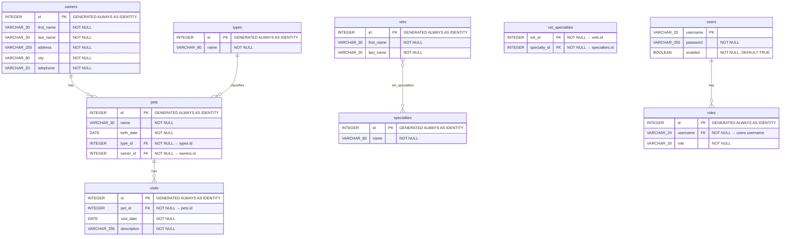

**Database Indexes:**
| Table | Index Name | Column(s) |
|-------|-----------|-----------|
| `vets` | `idx_vets_last_name` | `last_name` |
| `specialties` | `idx_specialties_name` | `name` |
| `types` | `idx_types_name` | `name` |
| `owners` | `idx_owners_last_name` | `last_name` |
| `pets` | `idx_pets_name` | `name` |
| `vet_specialties` | unique constraint | `(vet_id, specialty_id)` |
| `roles` | unique constraint | `(role, username)` |

---

## 4. API & Input Method Reference

**Base URL:** `http://localhost:9966/petclinic/api`

### 4.1 Owner Endpoints

#### `GET /owners`
- **Description:** List all owners, optionally filtered by last name prefix
- **Security:** `ROLE_OWNER_ADMIN`
- **Query Parameters:**

  | Parameter | Type | Required | Description |
  |-----------|------|----------|-------------|
  | `lastName` | string | No | Last name prefix filter (e.g., "Davis") |

- **Response Payload:**

  | Status | Body |
  |--------|------|
  | `200 OK` | `OwnerDto[]` — Array of owners with nested pets |
  | `404 Not Found` | Empty — No owners match criteria |
  | `500 Internal Server Error` | `ProblemDetail` |

- **Business Logic:** If `lastName` is provided, searches owners whose last name starts with the given string. If no owners found, returns 404.

#### `GET /owners/{ownerId}`
- **Description:** Get a single owner by ID
- **Security:** `ROLE_OWNER_ADMIN`
- **Path Parameters:**

  | Parameter | Type | Validation | Description |
  |-----------|------|------------|-------------|
  | `ownerId` | int32 | minimum: 0 | Owner ID |

- **Response Payload:**

  | Status | Body |
  |--------|------|
  | `200 OK` | `OwnerDto` — Owner with nested pets and visits |
  | `404 Not Found` | Empty — Owner not found |

#### `POST /owners`
- **Description:** Create a new owner
- **Security:** `ROLE_OWNER_ADMIN`
- **Request Payload (`OwnerFieldsDto`):**

  | Field | Type | Validation | Example |
  |-------|------|------------|---------|
  | `firstName` | string | required, 1-30 chars, pattern: `^[\p{L}]+([ '-][\p{L}]+){0,2}$` | "George" |
  | `lastName` | string | required, 1-30 chars, pattern: `^[\p{L}]+([ '-][\p{L}]+){0,2}\.?$` | "Franklin" |
  | `address` | string | required, 1-255 chars | "110 W. Liberty St." |
  | `city` | string | required, 1-80 chars | "Madison" |
  | `telephone` | string | required, 1-20 chars, pattern: `^[0-9]*$` | "6085551023" |

- **Response Payload:**

  | Status | Body | Headers |
  |--------|------|---------|
  | `201 Created` | `OwnerDto` | `Location: /api/owners/{id}` |
  | `400 Bad Request` | `ProblemDetail` with validation errors | |

- **Business Logic:** Maps DTO to entity, persists, returns created owner with generated ID.

#### `PUT /owners/{ownerId}`
- **Description:** Update an existing owner's details
- **Security:** `ROLE_OWNER_ADMIN`
- **Path Parameters:** `ownerId` (int32, min: 0)
- **Request Payload:** `OwnerFieldsDto` (same as POST)
- **Response Payload:**

  | Status | Body |
  |--------|------|
  | `204 No Content` | `OwnerDto` (updated) |
  | `404 Not Found` | Empty — Owner not found |

- **Business Logic:** Looks up existing owner; if found, updates fields individually (firstName, lastName, address, city, telephone) and saves.

#### `DELETE /owners/{ownerId}`
- **Description:** Delete an owner and all associated pets/visits (cascade)
- **Security:** `ROLE_OWNER_ADMIN`
- **Path Parameters:** `ownerId` (int32, min: 0)
- **Response Payload:**

  | Status | Body |
  |--------|------|
  | `204 No Content` | Empty |
  | `404 Not Found` | Empty — Owner not found |

---

### 4.2 Pet Endpoints (Owner-scoped)

#### `POST /owners/{ownerId}/pets`
- **Description:** Add a new pet to an owner
- **Security:** `ROLE_OWNER_ADMIN`
- **Path Parameters:** `ownerId` (int32, min: 0)
- **Request Payload (`PetFieldsDto`):**

  | Field | Type | Validation | Example |
  |-------|------|------------|---------|
  | `name` | string | required, max 30 chars | "Leo" |
  | `birthDate` | date (ISO 8601) | required | "2010-09-07" |
  | `type` | `PetTypeDto` | required | `{"id": 1, "name": "cat"}` |

- **Response Payload:**

  | Status | Body | Headers |
  |--------|------|---------|
  | `201 Created` | `PetDto` | `Location: /api/pets/{id}` |

- **Business Logic:** Creates pet, sets owner by ID, clears type name (resolves by type ID via service), saves.

#### `GET /owners/{ownerId}/pets/{petId}`
- **Description:** Get a specific pet belonging to an owner
- **Security:** `ROLE_OWNER_ADMIN`
- **Path Parameters:** `ownerId`, `petId` (int32, min: 0)
- **Response Payload:**

  | Status | Body |
  |--------|------|
  | `200 OK` | `PetDto` |
  | `404 Not Found` | Empty — Owner or pet not found |

- **Business Logic:** Loads owner, then searches for pet by ID within owner's pet collection.

#### `PUT /owners/{ownerId}/pets/{petId}`
- **Description:** Update a pet's details
- **Security:** `ROLE_OWNER_ADMIN`
- **Path Parameters:** `ownerId`, `petId` (int32, min: 0)
- **Request Payload:** `PetFieldsDto` (same as POST)
- **Response Payload:**

  | Status | Body |
  |--------|------|
  | `204 No Content` | Empty |
  | `404 Not Found` | Empty — Owner or pet not found |

---

### 4.3 Visit Endpoints

#### `POST /owners/{ownerId}/pets/{petId}/visits`
- **Description:** Record a new vet visit for a pet
- **Security:** `ROLE_OWNER_ADMIN`
- **Path Parameters:** `ownerId`, `petId` (int32, min: 0)
- **Request Payload (`VisitFieldsDto`):**

  | Field | Type | Validation | Example |
  |-------|------|------------|---------|
  | `date` | date (ISO 8601) | optional (defaults to today) | "2013-01-01" |
  | `description` | string | required, 1-255 chars | "rabies shot" |

- **Response Payload:**

  | Status | Body | Headers |
  |--------|------|---------|
  | `201 Created` | `VisitDto` | `Location: /api/visits/{id}` |

#### `GET /visits`
- **Description:** List all visits
- **Security:** `ROLE_OWNER_ADMIN`
- **Response Payload:**

  | Status | Body |
  |--------|------|
  | `200 OK` | `VisitDto[]` |
  | `404 Not Found` | Empty — No visits exist |

#### `GET /visits/{visitId}`
- **Description:** Get a visit by ID
- **Security:** `ROLE_OWNER_ADMIN`
- **Path Parameters:** `visitId` (int32, min: 0)
- **Response Payload:**

  | Status | Body |
  |--------|------|
  | `200 OK` | `VisitDto` |
  | `404 Not Found` | Empty |

#### `POST /visits`
- **Description:** Create a visit (standalone, with petId in body)
- **Security:** `ROLE_OWNER_ADMIN`
- **Request Payload (`VisitDto`):**

  | Field | Type | Validation | Example |
  |-------|------|------------|---------|
  | `id` | int32 | readOnly | |
  | `petId` | int32 | required, min: 0 | 1 |
  | `date` | date | optional | "2013-01-01" |
  | `description` | string | required, 1-255 chars | "rabies shot" |

- **Response Payload:**

  | Status | Body | Headers |
  |--------|------|---------|
  | `201 Created` | `VisitDto` | `Location: /api/visits/{id}` |

#### `PUT /visits/{visitId}`
- **Description:** Update a visit
- **Security:** `ROLE_OWNER_ADMIN`
- **Path Parameters:** `visitId` (int32, min: 0)
- **Request Payload:** `VisitFieldsDto`
- **Response Payload:**

  | Status | Body |
  |--------|------|
  | `204 No Content` | `VisitDto` (updated) |
  | `404 Not Found` | Empty |

#### `DELETE /visits/{visitId}`
- **Description:** Delete a visit
- **Security:** `ROLE_OWNER_ADMIN`
- **Path Parameters:** `visitId` (int32, min: 0)
- **Response Payload:**

  | Status | Body |
  |--------|------|
  | `204 No Content` | Empty |
  | `404 Not Found` | Empty |

---

### 4.4 Pet Endpoints (General)

#### `GET /pets`
- **Description:** List all pets
- **Security:** `ROLE_OWNER_ADMIN`
- **Response:** `200 OK` → `PetDto[]` | `404 Not Found`

#### `GET /pets/{petId}`
- **Description:** Get a pet by ID
- **Security:** `ROLE_OWNER_ADMIN`
- **Response:** `200 OK` → `PetDto` | `404 Not Found`

#### `PUT /pets/{petId}`
- **Description:** Update a pet
- **Security:** `ROLE_OWNER_ADMIN`
- **Request Payload:** `PetDto`
- **Response:** `204 No Content` → `PetDto` | `404 Not Found`
- **Business Logic:** Loads existing pet, updates name/birthDate/type, saves.

#### `DELETE /pets/{petId}`
- **Description:** Delete a pet (cascades to visits)
- **Security:** `ROLE_OWNER_ADMIN`
- **Response:** `204 No Content` | `404 Not Found`

---

### 4.5 Pet Type Endpoints

#### `GET /pettypes`
- **Description:** List all pet types
- **Security:** `ROLE_OWNER_ADMIN` or `ROLE_VET_ADMIN`
- **Response:** `200 OK` → `PetTypeDto[]` | `404 Not Found`

#### `GET /pettypes/{petTypeId}`
- **Description:** Get a pet type by ID
- **Security:** `ROLE_OWNER_ADMIN` or `ROLE_VET_ADMIN`
- **Response:** `200 OK` → `PetTypeDto` | `404 Not Found`

#### `POST /pettypes`
- **Description:** Create a pet type
- **Security:** `ROLE_VET_ADMIN`
- **Request Payload (`PetTypeFieldsDto`):**

  | Field | Type | Validation | Example |
  |-------|------|------------|---------|
  | `name` | string | required, 1-80 chars | "cat" |

- **Response:** `201 Created` → `PetTypeDto` with `Location` header

#### `PUT /pettypes/{petTypeId}`
- **Description:** Update a pet type
- **Security:** `ROLE_VET_ADMIN`
- **Request Payload:** `PetTypeDto`
- **Response:** `204 No Content` → `PetTypeDto` | `404 Not Found`

#### `DELETE /pettypes/{petTypeId}`
- **Description:** Delete a pet type (cascades to pets and visits)
- **Security:** `ROLE_VET_ADMIN`
- **Response:** `204 No Content` | `404 Not Found`

---

### 4.6 Vet Endpoints

#### `GET /vets`
- **Description:** List all veterinarians
- **Security:** `ROLE_VET_ADMIN`
- **Response:** `200 OK` → `VetDto[]` | `404 Not Found`

#### `GET /vets/{vetId}`
- **Description:** Get a vet by ID
- **Security:** `ROLE_VET_ADMIN`
- **Response:** `200 OK` → `VetDto` | `404 Not Found`

#### `POST /vets`
- **Description:** Create a vet
- **Security:** `ROLE_VET_ADMIN`
- **Request Payload (`VetDto`):**

  | Field | Type | Validation | Example |
  |-------|------|------------|---------|
  | `firstName` | string | required, 1-30 chars, pattern: `^[\p{L}]+([ '-][\p{L}]+){0,2}$` | "James" |
  | `lastName` | string | required, 1-30 chars, pattern: `^[\p{L}]+([ '-][\p{L}]+){0,2}\.?$` | "Carter" |
  | `specialties` | `SpecialtyDto[]` | required | `[{"id": 1, "name": "radiology"}]` |

- **Response:** `201 Created` → `VetDto` with `Location` header
- **Business Logic:** If specialties are provided, resolves them by name from the database to link existing specialty entities rather than creating duplicates.

#### `PUT /vets/{vetId}`
- **Description:** Update a vet
- **Security:** `ROLE_VET_ADMIN`
- **Request Payload:** `VetDto`
- **Response:** `204 No Content` → `VetDto` | `404 Not Found`
- **Business Logic:** Clears existing specialties, adds new ones from DTO, resolves by name from DB, saves.

#### `DELETE /vets/{vetId}`
- **Description:** Delete a vet (removes vet_specialties associations)
- **Security:** `ROLE_VET_ADMIN`
- **Response:** `204 No Content` | `404 Not Found`

---

### 4.7 Specialty Endpoints

#### `GET /specialties`
- **Description:** List all specialties
- **Security:** `ROLE_VET_ADMIN`
- **Response:** `200 OK` → `SpecialtyDto[]` | `404 Not Found`

#### `GET /specialties/{specialtyId}`
- **Description:** Get a specialty by ID
- **Security:** `ROLE_VET_ADMIN`
- **Response:** `200 OK` → `SpecialtyDto` | `404 Not Found`

#### `POST /specialties`
- **Description:** Create a specialty
- **Security:** `ROLE_VET_ADMIN`
- **Request Payload (`SpecialtyDto`):**

  | Field | Type | Validation | Example |
  |-------|------|------------|---------|
  | `name` | string | required, 1-80 chars | "radiology" |

- **Response:** `201 Created` → `SpecialtyDto` with `Location` header

#### `PUT /specialties/{specialtyId}`
- **Description:** Update a specialty
- **Security:** `ROLE_VET_ADMIN`
- **Request Payload:** `SpecialtyDto`
- **Response:** `204 No Content` → `SpecialtyDto` | `404 Not Found`

#### `DELETE /specialties/{specialtyId}`
- **Description:** Delete a specialty (removes vet_specialties associations)
- **Security:** `ROLE_VET_ADMIN`
- **Response:** `204 No Content` | `404 Not Found`

---

### 4.8 User Endpoint

#### `POST /users`
- **Description:** Create a user with roles
- **Security:** `ROLE_ADMIN`
- **Request Payload (`UserDto`):**

  | Field | Type | Validation | Example |
  |-------|------|------------|---------|
  | `username` | string | required, 1-80 chars | "john.doe" |
  | `password` | string | optional, 1-80 chars | "1234abc" |
  | `enabled` | boolean | optional | true |
  | `roles` | `RoleDto[]` | optional | `[{"name": "VET_ADMIN"}]` |

- **Response:** `201 Created` → `UserDto`
- **Business Logic:** Validates user has at least one role. Automatically prepends `ROLE_` prefix to role names if missing. Associates role back-references to user.

---

### 4.9 Global Error Responses

All endpoints use `ExceptionControllerAdvice` for consistent error handling:

| Exception | HTTP Status | Response Body |
|-----------|-------------|---------------|
| `MethodArgumentNotValidException` | `400 Bad Request` | `ProblemDetail` with `schemaValidationErrors` |
| `DataIntegrityViolationException` | `404 Not Found` | `ProblemDetail` |
| `Exception` (general) | `500 Internal Server Error` | `ProblemDetail` with timestamp and request URI |

**ProblemDetail format (RFC 7807):**
```json
{
  "type": "http://localhost:9966/petclinic/api/owners",
  "title": "NoResourceFoundException",
  "status": 500,
  "detail": "No static resource api/owner",
  "timestamp": "2024-11-23T13:59:21.382Z",
  "schemaValidationErrors": [
    {"message": "[Path '/lastName'] Instance type (null) does not match any allowed primitive type"}
  ]
}
```

---

## 5. Sequence Diagrams

### 5.1 List Owners (`GET /owners` and `GET /owners?lastName=...`)

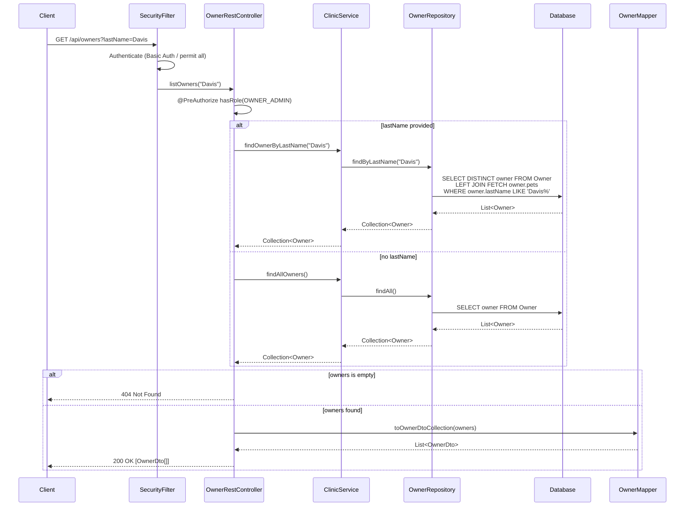

### 5.2 Get Owner by ID (`GET /owners/{ownerId}`)

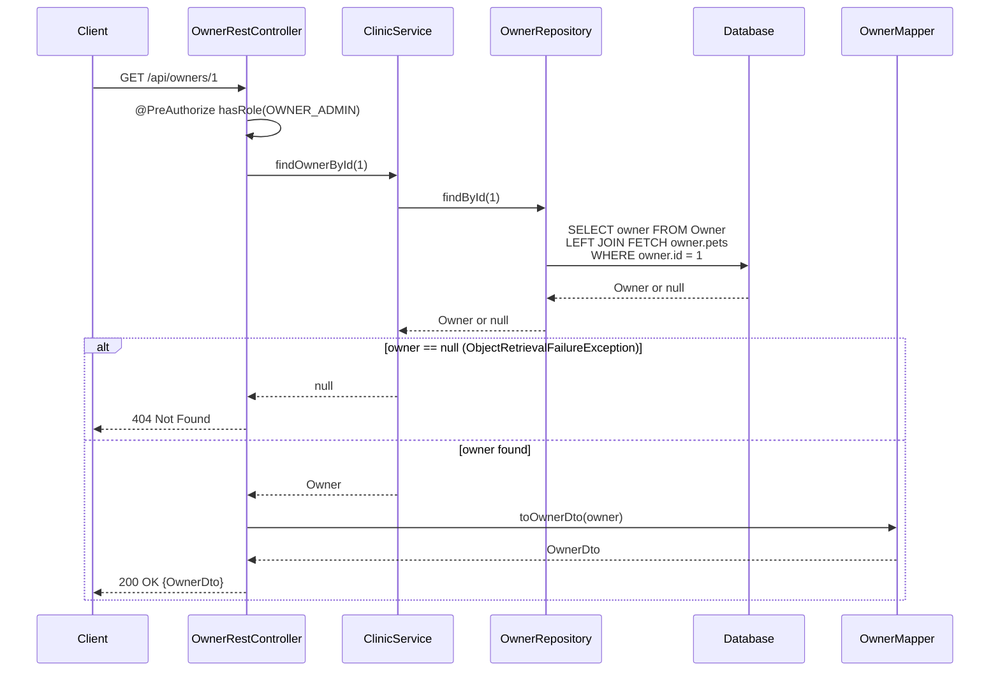

### 5.3 Create Owner (`POST /owners`)

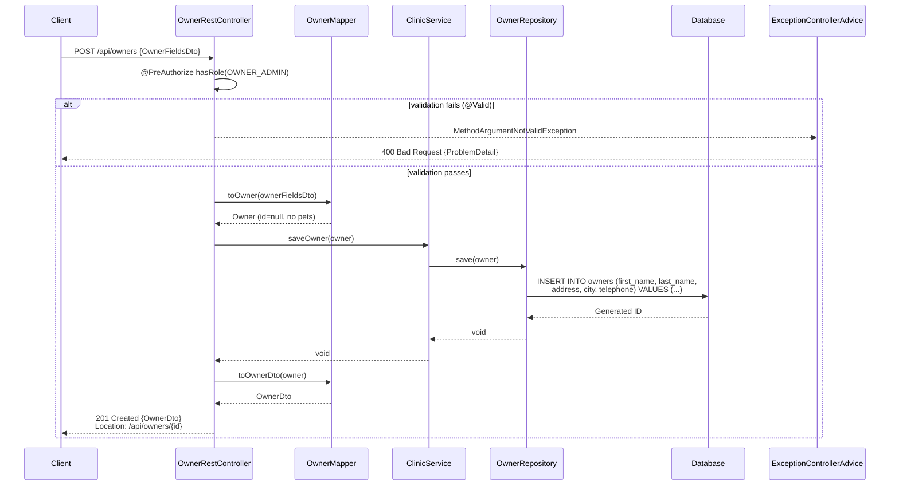

### 5.4 Update Owner (`PUT /owners/{ownerId}`)

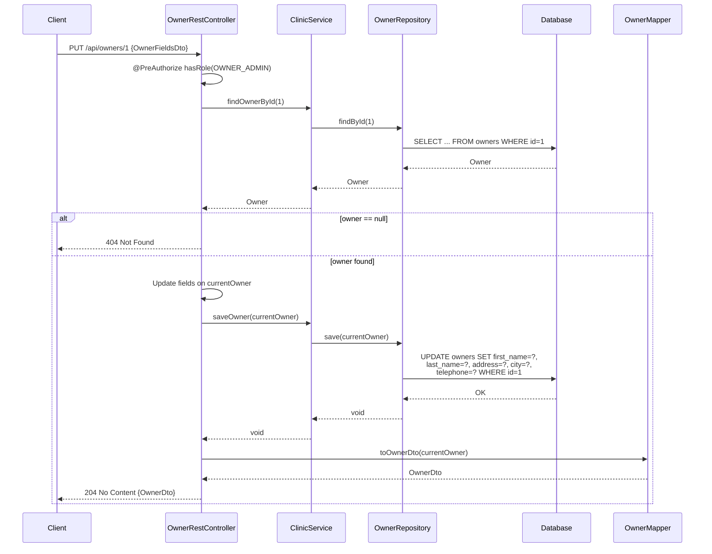

### 5.5 Delete Owner (`DELETE /owners/{ownerId}`)

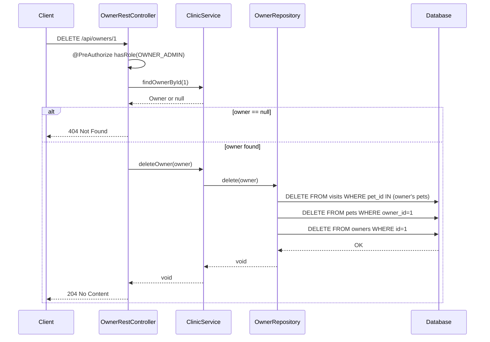

### 5.6 Add Pet to Owner (`POST /owners/{ownerId}/pets`)

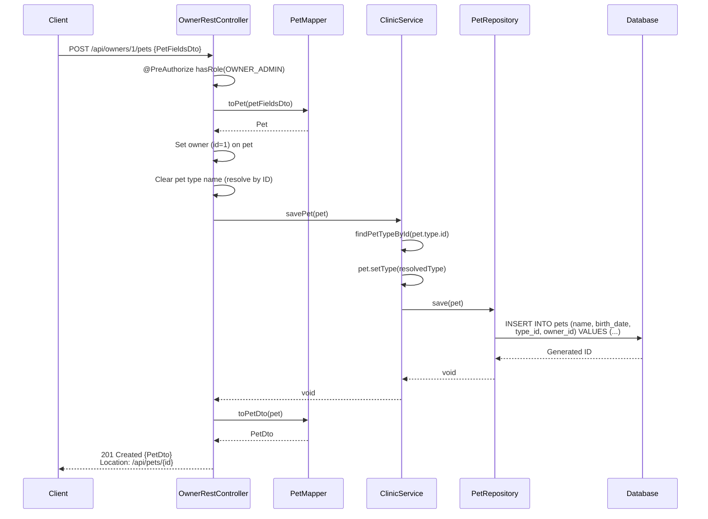

### 5.7 Add Visit to Pet (`POST /owners/{ownerId}/pets/{petId}/visits`)

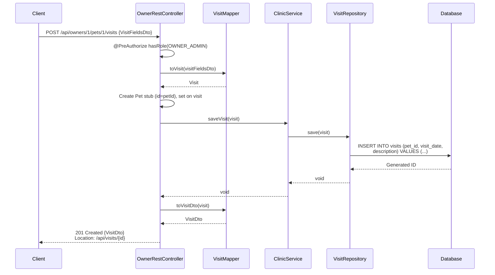

### 5.8 Create Vet with Specialties (`POST /vets`)

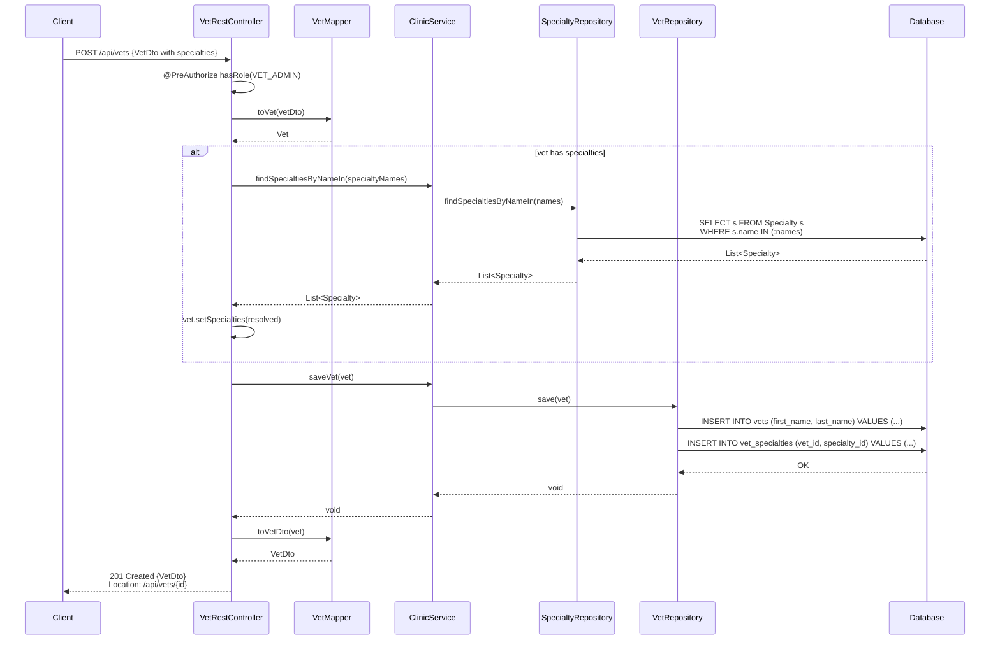

### 5.9 CRUD Visit (Standalone: `GET`, `PUT`, `DELETE /visits/{visitId}`)

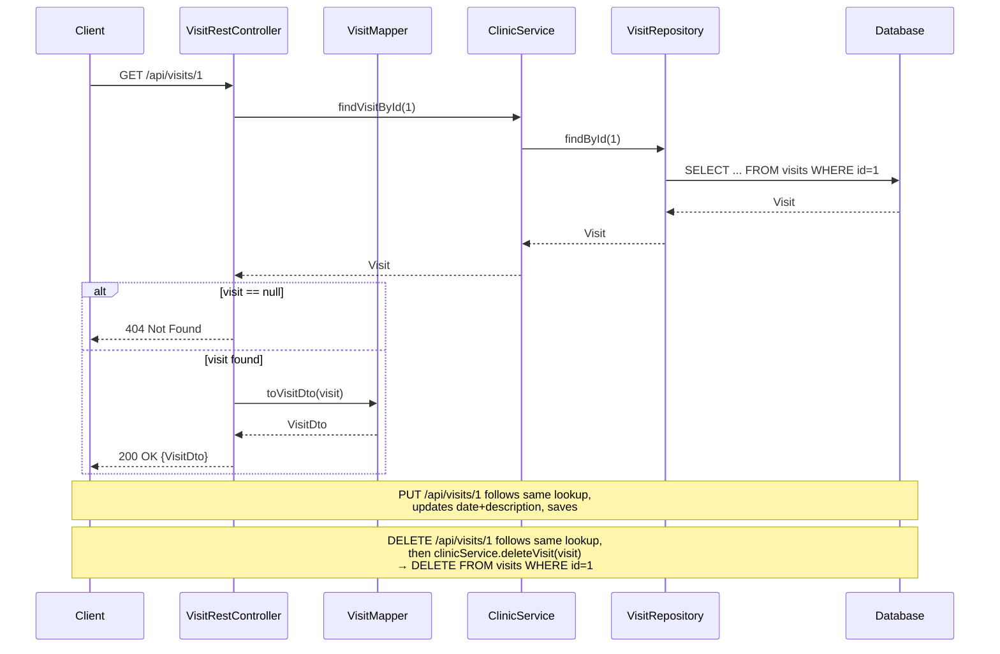

### 5.10 Create User (`POST /users`)

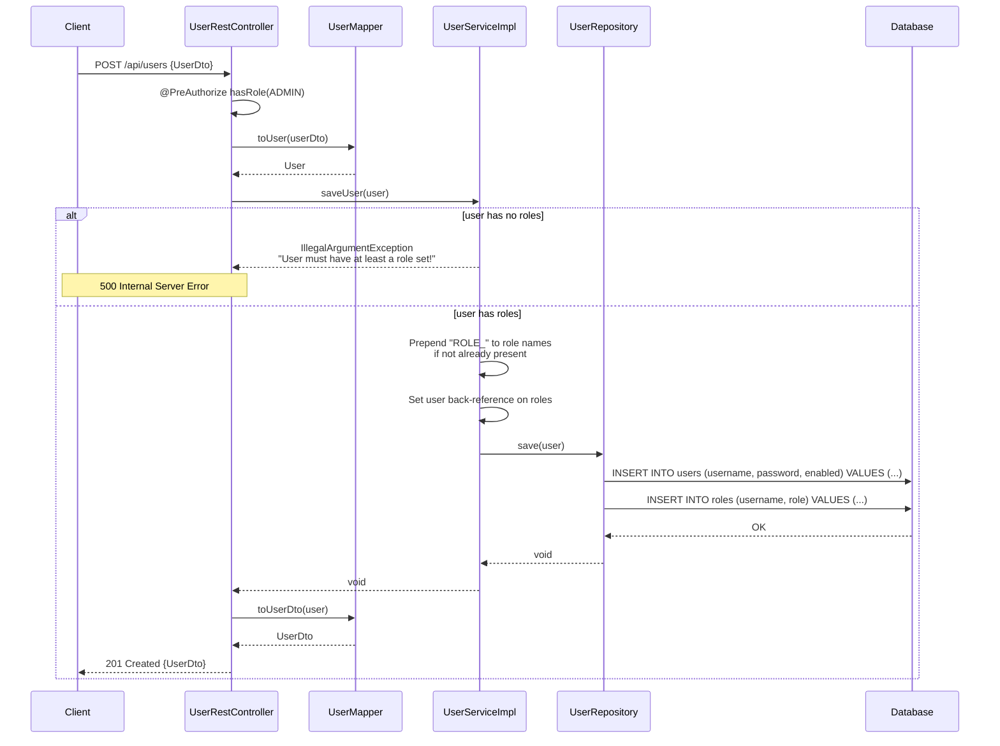

### 5.11 PetType CRUD (representative: `POST /pettypes`, `DELETE /pettypes/{id}`)

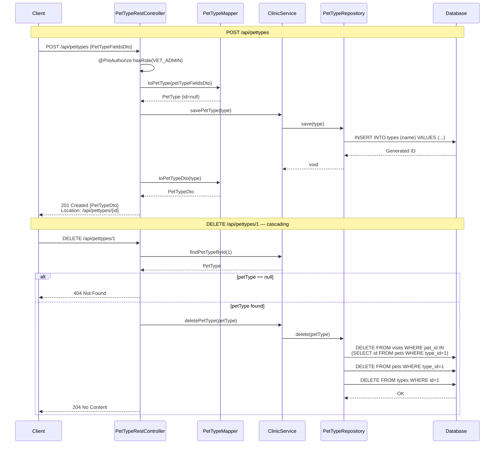

### 5.12 Specialty CRUD (representative: `DELETE /specialties/{id}`)

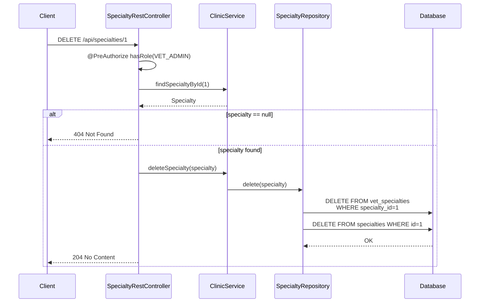

---

## 6. DAO Layer — SQL Reference

All queries are documented for the **JPA** (JPQL) and **JDBC** (raw SQL) implementations. The **Spring Data JPA** implementation uses the same JPQL queries via `@Query` annotations or generates them from method names.

### 6.1 OwnerRepository

#### `findByLastName(String lastName)`
- **Purpose:** Find owners whose last name starts with the given prefix
- **JPA (JPQL):**
  ```sql
  SELECT DISTINCT owner FROM Owner owner
  LEFT JOIN FETCH owner.pets
  WHERE owner.lastName LIKE :lastName%
  ```
- **JDBC (SQL):**
  ```sql
  SELECT id, first_name, last_name, address, city, telephone
  FROM owners
  WHERE last_name LIKE :lastName%
  ```
  Followed by `loadPetsAndVisits()` for each owner.
- **Parameters:** `lastName` (String) — prefix to match
- **Returns:** `Collection<Owner>`
- **Index used:** `idx_owners_last_name` on `owners(last_name)`

#### `findById(int id)`
- **Purpose:** Retrieve a single owner with eagerly fetched pets
- **JPA (JPQL):**
  ```sql
  SELECT owner FROM Owner owner
  LEFT JOIN FETCH owner.pets
  WHERE owner.id = :id
  ```
- **JDBC (SQL):**
  ```sql
  SELECT id, first_name, last_name, address, city, telephone
  FROM owners
  WHERE id = :id
  ```
  Followed by pet/visit loading query:
  ```sql
  SELECT pets.id AS pets_id, name, birth_date, type_id, owner_id,
         visits.id AS visit_id, visit_date, description, visits.pet_id AS visits_pet_id
  FROM pets
  LEFT OUTER JOIN visits ON pets.id = visits.pet_id
  WHERE owner_id = :id
  ORDER BY pets.id
  ```
- **Parameters:** `id` (int) — owner primary key
- **Returns:** `Owner` (or null if not found)

#### `findAll()`
- **Purpose:** Retrieve all owners
- **JPA (JPQL):**
  ```sql
  SELECT owner FROM Owner owner
  ```
- **JDBC (SQL):**
  ```sql
  SELECT id, first_name, last_name, address, city, telephone FROM owners
  ```
- **Returns:** `Collection<Owner>`

#### `save(Owner owner)`
- **Purpose:** Insert or update an owner
- **JPA:** `em.persist(owner)` for new, `em.merge(owner)` for existing (checked via `owner.getId()`)
- **JDBC (Insert):** `SimpleJdbcInsert` on table `owners` with generated key `id`
- **JDBC (Update):**
  ```sql
  UPDATE owners
  SET first_name = :firstName, last_name = :lastName,
      address = :address, city = :city, telephone = :telephone
  WHERE id = :id
  ```

#### `delete(Owner owner)`
- **Purpose:** Delete owner with cascading deletes for pets and visits
- **JPA:** `em.remove(em.contains(owner) ? owner : em.merge(owner))`
- **JDBC (SQL) — cascading:**
  ```sql
  DELETE FROM visits WHERE pet_id = :petId    -- for each pet
  DELETE FROM pets WHERE id = :petId          -- for each pet
  DELETE FROM owners WHERE id = :ownerId
  ```

---

### 6.2 PetRepository

#### `findById(int id)`
- **Purpose:** Retrieve a pet by ID
- **JPA:** `em.find(Pet.class, id)`
- **JDBC:** Finds owner_id first, then loads owner's pet collection:
  ```sql
  SELECT owner_id FROM pets WHERE id = :id
  ```
- **Returns:** `Pet`

#### `findAll()`
- **Purpose:** Retrieve all pets
- **JPA (JPQL):**
  ```sql
  SELECT pet FROM Pet pet
  ```
- **JDBC (SQL):**
  ```sql
  SELECT pets.id AS pets_id, name, birth_date, type_id, owner_id FROM pets
  ```
  Plus type and owner lookups.
- **Returns:** `Collection<Pet>`

#### `findPetTypes()`
- **Purpose:** List all pet types (ordered by name)
- **JPA (JPQL):**
  ```sql
  SELECT ptype FROM PetType ptype ORDER BY ptype.name
  ```
- **JDBC (SQL):**
  ```sql
  SELECT id, name FROM types ORDER BY name
  ```
- **Returns:** `List<PetType>`
- **Index used:** `idx_types_name` on `types(name)`

#### `save(Pet pet)`
- **Purpose:** Insert or update a pet
- **JPA:** `em.persist(pet)` / `em.merge(pet)`
- **JDBC (Insert):** `SimpleJdbcInsert` on table `pets`
- **JDBC (Update):**
  ```sql
  UPDATE pets
  SET name = :name, birth_date = :birth_date,
      type_id = :type_id, owner_id = :owner_id
  WHERE id = :id
  ```

#### `delete(Pet pet)`
- **Purpose:** Delete pet with cascading visit deletion
- **JPA (JPQL) — cascading:**
  ```sql
  DELETE FROM Visit visit WHERE pet.id = :petId
  DELETE FROM Pet pet WHERE id = :petId
  ```
- **JDBC (SQL):**
  ```sql
  DELETE FROM visits WHERE pet_id = :id
  DELETE FROM pets WHERE id = :id
  ```

---

### 6.3 VisitRepository

#### `findByPetId(int petId)`
- **Purpose:** Retrieve all visits for a given pet
- **JPA (JPQL):**
  ```sql
  SELECT v FROM Visit v WHERE v.pet.id = :id
  ```
- **JDBC (SQL):**
  ```sql
  SELECT id AS visit_id, visit_date, description
  FROM visits
  WHERE pet_id = :id
  ```
- **Parameters:** `petId` (int)
- **Returns:** `List<Visit>`

#### `findById(int id)`
- **Purpose:** Retrieve a visit by ID
- **JPA:** `em.find(Visit.class, id)`
- **JDBC (SQL):**
  ```sql
  SELECT id AS visit_id, visits.pet_id AS pets_id, visit_date, description
  FROM visits
  WHERE id = :id
  ```
- **Returns:** `Visit`

#### `findAll()`
- **Purpose:** Retrieve all visits
- **JPA (JPQL):**
  ```sql
  SELECT v FROM Visit v
  ```
- **JDBC (SQL):**
  ```sql
  SELECT visits.id AS visit_id, pets.id AS pets_id, visit_date, description
  FROM visits
  LEFT JOIN pets ON visits.pet_id = pets.id
  ```
- **Returns:** `Collection<Visit>`

#### `save(Visit visit)`
- **Purpose:** Insert or update a visit
- **JPA:** `em.persist(visit)` / `em.merge(visit)`
- **JDBC (Insert):** `SimpleJdbcInsert` on table `visits`
- **JDBC (Update):**
  ```sql
  UPDATE visits
  SET visit_date = :visit_date, description = :description, pet_id = :pet_id
  WHERE id = :id
  ```

#### `delete(Visit visit)`
- **Purpose:** Delete a single visit
- **JPA (JPQL):**
  ```sql
  DELETE FROM Visit visit WHERE id = :visitId
  ```
- **JDBC (SQL):**
  ```sql
  DELETE FROM visits WHERE id = :id
  ```

---

### 6.4 VetRepository

#### `findAll()`
- **Purpose:** Retrieve all vets with their specialties
- **JPA (JPQL):**
  ```sql
  SELECT vet FROM Vet vet
  ```
  (Specialties loaded via `@ManyToMany(fetch = FetchType.EAGER)`)
- **JDBC (SQL) — three queries:**
  ```sql
  SELECT id, first_name, last_name FROM vets ORDER BY last_name, first_name

  SELECT id, name FROM specialties

  SELECT specialty_id FROM vet_specialties WHERE vet_id = ?
  -- (executed per vet)
  ```
- **Returns:** `Collection<Vet>`
- **Index used:** `idx_vets_last_name` on `vets(last_name)`

#### `findById(int id)`
- **Purpose:** Retrieve a vet by ID with specialties
- **JPA:** `em.find(Vet.class, id)`
- **JDBC (SQL):**
  ```sql
  SELECT id, first_name, last_name FROM vets WHERE id = :id

  SELECT id, name FROM specialties

  SELECT specialty_id FROM vet_specialties WHERE vet_id = :id
  ```
- **Returns:** `Vet`

#### `save(Vet vet)`
- **Purpose:** Insert or update a vet
- **JPA:** `em.persist(vet)` / `em.merge(vet)`
- **JDBC (Insert):** `SimpleJdbcInsert` on table `vets`, followed by specialty associations
- **JDBC (Update):**
  ```sql
  UPDATE vets SET first_name = :firstName, last_name = :lastName WHERE id = :id
  ```
  Then `updateVetSpecialties()`:
  ```sql
  DELETE FROM vet_specialties WHERE vet_id = :id
  INSERT INTO vet_specialties VALUES (:id, :spec_id)
  -- (per specialty)
  ```

#### `delete(Vet vet)`
- **Purpose:** Delete a vet and its specialty associations
- **JPA:** `em.remove(vet)`
- **JDBC (SQL):**
  ```sql
  DELETE FROM vet_specialties WHERE vet_id = :id
  DELETE FROM vets WHERE id = :id
  ```

---

### 6.5 SpecialtyRepository

#### `findById(int id)`
- **Purpose:** Retrieve a specialty by ID
- **JPA:** `em.find(Specialty.class, id)`
- **JDBC (SQL):**
  ```sql
  SELECT id, name FROM specialties WHERE id = :id
  ```
- **Returns:** `Specialty`

#### `findSpecialtiesByNameIn(Set<String> names)`
- **Purpose:** Find specialties matching a set of names (used for vet specialty resolution)
- **JPA (JPQL):**
  ```sql
  SELECT s FROM Specialty s WHERE s.name IN :names
  ```
- **JDBC (SQL):**
  ```sql
  SELECT id, name FROM specialties WHERE specialties.name IN (:names)
  ```
- **Parameters:** `names` (Set\<String\>)
- **Returns:** `List<Specialty>`
- **Index used:** `idx_specialties_name` on `specialties(name)`

#### `findAll()`
- **Purpose:** Retrieve all specialties
- **JPA (JPQL):**
  ```sql
  SELECT s FROM Specialty s
  ```
- **JDBC (SQL):**
  ```sql
  SELECT id, name FROM specialties
  ```

#### `save(Specialty specialty)`
- **JPA:** `em.persist()` / `em.merge()`
- **JDBC (Insert):** `SimpleJdbcInsert` on table `specialties`
- **JDBC (Update):**
  ```sql
  UPDATE specialties SET name = :name WHERE id = :id
  ```

#### `delete(Specialty specialty)`
- **Purpose:** Delete specialty and remove vet associations
- **JPA — native SQL + JPQL:**
  ```sql
  DELETE FROM vet_specialties WHERE specialty_id = :specId  -- native
  DELETE FROM Specialty specialty WHERE id = :specId        -- JPQL
  ```
- **JDBC (SQL):**
  ```sql
  DELETE FROM vet_specialties WHERE specialty_id = :id
  DELETE FROM specialties WHERE id = :id
  ```

---

### 6.6 PetTypeRepository

#### `findById(int id)`
- **JPA:** `em.find(PetType.class, id)`
- **JDBC (SQL):**
  ```sql
  SELECT id, name FROM types WHERE id = :id
  ```

#### `findByName(String name)`
- **JPA (JPQL):**
  ```sql
  SELECT p FROM PetType p WHERE p.name = :name
  ```
- **JDBC (SQL):**
  ```sql
  SELECT id, name FROM types WHERE name = :name
  ```

#### `findAll()`
- **JPA (JPQL):**
  ```sql
  SELECT ptype FROM PetType ptype
  ```
- **JDBC (SQL):**
  ```sql
  SELECT id, name FROM types
  ```

#### `delete(PetType petType)`
- **Purpose:** Delete pet type with cascading deletes for all pets of that type and their visits
- **JPA — cascading JPQL:**
  ```sql
  DELETE FROM Visit visit WHERE pet.id = :petId   -- per pet of this type
  DELETE FROM Pet pet WHERE id = :petId           -- per pet of this type
  DELETE FROM PetType petType WHERE id = :typeId
  ```
- **JDBC — cascading SQL:**
  ```sql
  SELECT pets.id, name, birth_date, type_id, owner_id FROM pets WHERE type_id = :id
  SELECT id, pet_id, visit_date, description FROM visits WHERE pet_id = :petId
  DELETE FROM visits WHERE id = :visitId          -- per visit
  DELETE FROM pets WHERE id = :petId              -- per pet
  DELETE FROM types WHERE id = :id
  ```

---

### 6.7 UserRepository

#### `save(User user)`
- **Purpose:** Insert or update a user with roles
- **JPA:**
  ```java
  em.find(User.class, user.getUsername())  // check existence
  em.persist(user)  // or em.merge(user)
  ```
- **JDBC — check existence:**
  ```sql
  SELECT * FROM users WHERE username = :username
  ```
- **JDBC (Insert):** `SimpleJdbcInsert` on table `users`
- **JDBC (Update):**
  ```sql
  UPDATE users SET password = :password, enabled = :enabled WHERE username = :username
  ```
- **JDBC — role management:**
  ```sql
  DELETE FROM roles WHERE username = :username
  INSERT INTO roles (username, role) VALUES (:username, :role)
  -- (per role)
  ```
